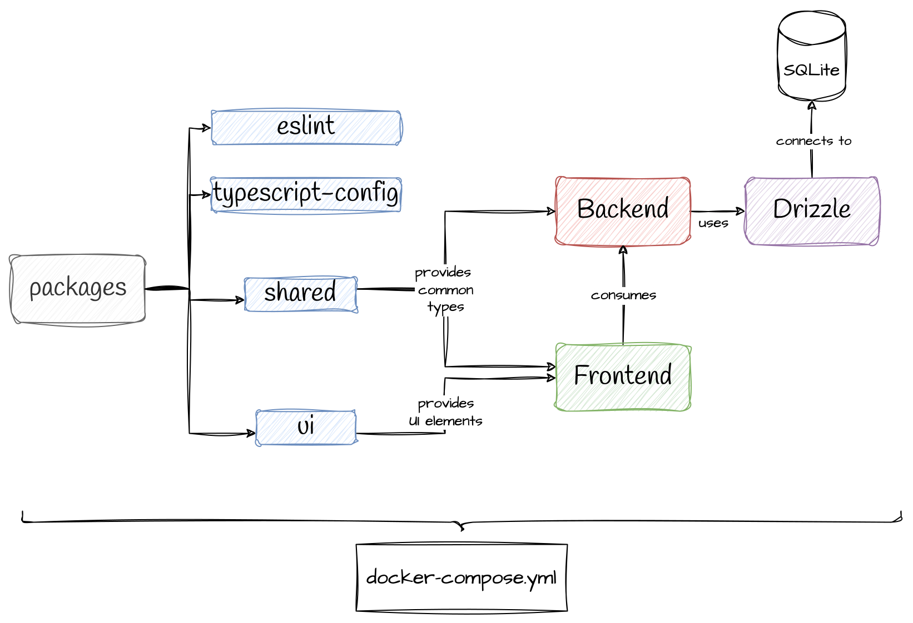

# ☀️ Bright Solar Offer Summary Monorepo

This repository contains the codebase for the Bright Solar Offer Summary project. It is organized as a monorepo using `pnpm` powered by [https://turbo.build/](turborepo), containing both the backend and frontend applications, as well as shared packages.

## 📚 Table of Contents
- [☀️ Bright Solar Offer Summary Monorepo](#️-bright-solar-offer-summary-monorepo)
  - [📚 Table of Contents](#-table-of-contents)
  - [🚀 Try it](#-try-it)
  - [📖 API Docs](#-api-docs)
  - [🖥️ Running the Project Locally](#️-running-the-project-locally)
    - [📋 Requirements:](#-requirements)
  - [🗂️ Structure](#️-structure)
  - [📝 Diagram](#-diagram)
  - [Apps](#apps)
    - [🔧 Backend](#-backend)
      - [Running the Project](#running-the-project)
      - [Running Tests](#running-tests)
    - [🌐 Frontend](#-frontend)
      - [Running the Project](#running-the-project-1)
      - [Running Tests](#running-tests-1)
  - [📦 Packages](#-packages)
    - [eslint-config-custom](#eslint-config-custom)
    - [🧩 shared](#-shared)
    - [📝 typescript-config](#-typescript-config)
    - [🎨 ui](#-ui)
  - [⚙️ Scripts](#️-scripts)
  - [🛠️ Configuration](#️-configuration)
  - [🧪 Testing](#-testing)

## 🚀 Try it
The solution shines bright like a diamond at [https://bright.misaelabanto.com](https://bright.misaelabanto.com)!

## 📖 API Docs
The API documentation is available at [https://api.bright.misaelabanto.com/docs](https://api.bright.misaelabanto.com/docs).

## 🖥️ Running the Project Locally

Both backend and frontend applications are located in the `apps` directory. To start the project on your machine, follow these steps:

1. Ensure you're in the root directory of the project.
2. Run the following command:

```bash
docker compose up --build
```

This will start both the backend and frontend in development mode.

### 📋 Requirements:
- Docker
- Docker Compose


## 🗂️ Structure

The repository is structured as follows:

```
.
├── .gitignore
├── .npmrc
├── .nvmrc
├── .vscode/
│   └── settings.json
├── apps/
│   ├── backend/
│   │   ├── .gitignore
│   │   ├── coverage/
│   │   ├── drizzle/
│   │   ├── drizzle.config.ts
│   │   ├── eslint.config.mjs
│   │   ├── nest-cli.json
│   │   ├── package.json
│   │   ├── README.md
│   │   ├── src/
│   │   ├── tsconfig.build.json
│   │   ├── tsconfig.json
│   │   └── vitest.config.mts
│   ├── frontend/
│   │   ├── .env
│   │   ├── .gitignore
│   │   ├── eslint.config.js
│   │   ├── index.html
│   │   ├── package.json
│   │   ├── postcss.config.js
│   │   ├── public/
│   │   └── README.md
├── package.json
├── packages/
│   ├── eslint-config-custom/
│   ├── shared/
│   ├── typescript-config/
│   └── ui/
├── pnpm-lock.yaml
├── pnpm-workspace.yaml
└── turbo.json
```

## 📝 Diagram


## Apps

### 🔧 Backend

The backend application is built using NestJS and provides the API for scheduling messages to be sent to customers.

- **Location**: `apps/backend`
- **Main Entry Point**: `src/main.ts`
- **Configuration**: `nest-cli.json`, `tsconfig.json`
- **Scripts**:
  - `pnpm run dev`: Starts the development server.
  - `pnpm run test`: Runs the unit tests.
  - `pnpm db:generate`: Generates new database migrations.
  - `pnpm db:migrate`: Runs the database migrations.

#### Running the Project

To start the backend server, run:

```bash
pnpm run dev
```

#### Running Tests

To run the test suite, execute:

```bash
pnpm run test
```

Tests can be found in the `src` directory, with coverage reports enabled by default.

### 🌐 Frontend

The frontend application is built using React and Vite, providing the user interface for the Bright Solar Offer Summary.

- **Location**: `apps/frontend`
- **Main Entry Point**: `index.html`
- **Configuration**: `vite.config.ts`, `tsconfig.json`
- **Scripts**:
  - `pnpm run dev`: Starts the development server.
  - `pnpm run build`: Builds the application for production.
  - `pnpm run lint`: Runs the linter to check for code style and errors.
  - `pnpm run preview`: Previews the production build.
  - `pnpm run test`: Runs the unit tests.

#### Running the Project

To start the frontend development server, run:

```bash
pnpm run dev
```

#### Running Tests

To run the test suite, execute:

```bash
pnpm run test
```

This will run all unit tests located in the `src/` directory for each component.

## 📦 Packages

### eslint-config-custom

This package contains the shared ESLint configuration used across the monorepo.

- **Location**: `packages/eslint-config-custom`
- **Main Entry Point**: `app.js` or `library.js`

### 🧩 shared

This package contains shared utilities and types used across the backend and frontend applications.

- **Location**: `packages/shared`
- **Main Entry Point**: src/index.ts
- **Dependencies**:
  - `@bright-offer-summary/typescript-config`: Shared TypeScript configuration.

### 📝 typescript-config

This package contains the shared TypeScript configuration used across the monorepo.

- **Location**: `packages/typescript-config`
- **Main Entry Point**: tsconfig.json

### 🎨 ui

This package contains shared UI components used in the frontend application.

- **Location**: `packages/ui`
- **Main Entry Point**: src/index.ts
- **Configuration**:
  - **TypeScript**: The TypeScript configuration is defined in the `tsconfig.json` and `tsconfig.lint.json` files. It extends the shared configuration from `@bright-offer-summary/typescript-config`.
  - **ESLint**: The ESLint configuration is defined in the `.eslintrc.js` file. It extends the shared configuration from `@bright-offer-summary/eslint-config`.

## ⚙️ Scripts

The repository uses `pnpm` for managing dependencies and running scripts. The main scripts available are:

- `pnpm run dev`: Starts the development server for both backend and frontend applications.
- `pnpm run build`: Builds the backend and frontend applications for production.
- `pnpm run lint`: Runs the linter to check for code style and errors.
- `pnpm run test`: Runs the unit tests for both backend and frontend applications.

## 🛠️ Configuration

The repository uses shared configurations for TypeScript and ESLint, defined in the `packages/typescript-config` and `packages/eslint-config-custom` packages, respectively.

## 🧪 Testing

The repository uses **Vitest** for unit testing. Tests can be run using the `pnpm run test` script in both the backend and frontend applications.

For more details on running tests, refer to the [backend README](apps/backend/README.md) and [frontend README](apps/frontend/README.md).
